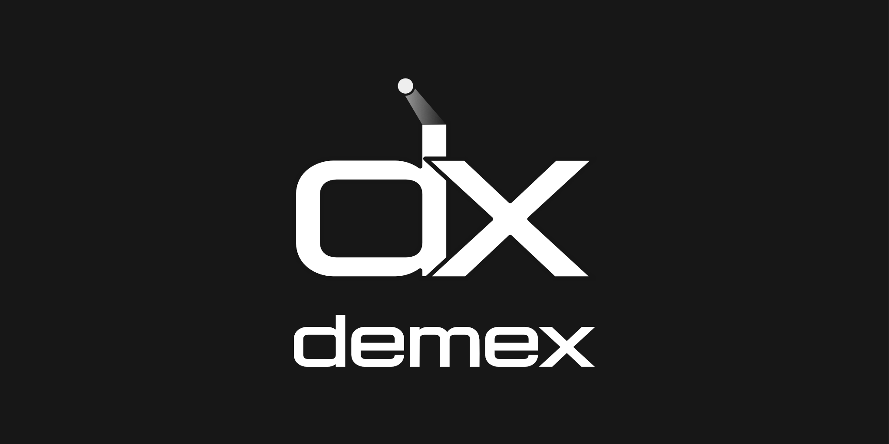

## What is demex?

demex is a command based DMX-Lighting control application written in Rust. It's command syntax and functionality is heavily inspired by the _ETC Eos_ family and _MA_ family of lighting consoles.

## Contributing

Pull requests are welcome. For major changes, please open an issue first to discuss what you would like to change.

## License

This project is licensed under the MIT License. See [LICENSE](LICENSE) for more informations.

---

> [matteolutz.de](https://matteolutz.de) &nbsp;&middot;&nbsp;
> GitHub [@matteolutz](https://github.com/matteolutz) &nbsp;&middot;&nbsp;
> Email [info@matteolutz.de](mailto:info@matteolutz.de)
